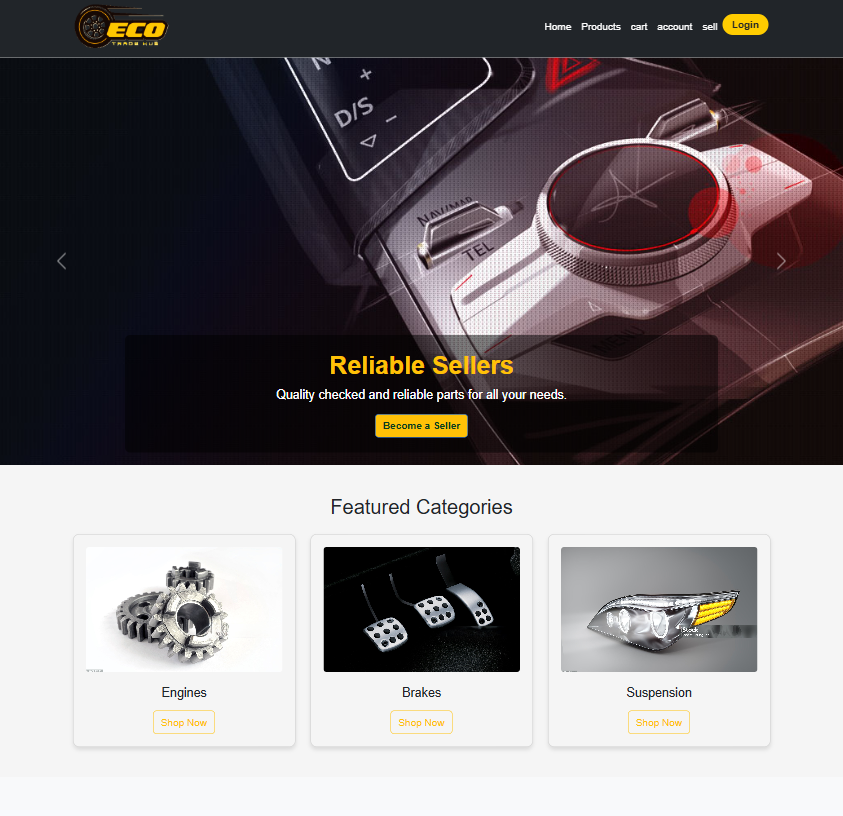
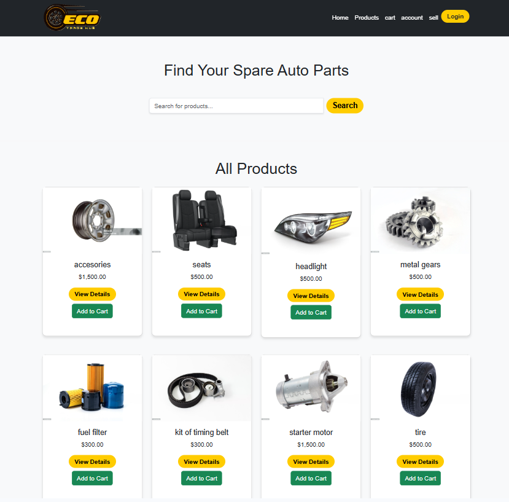
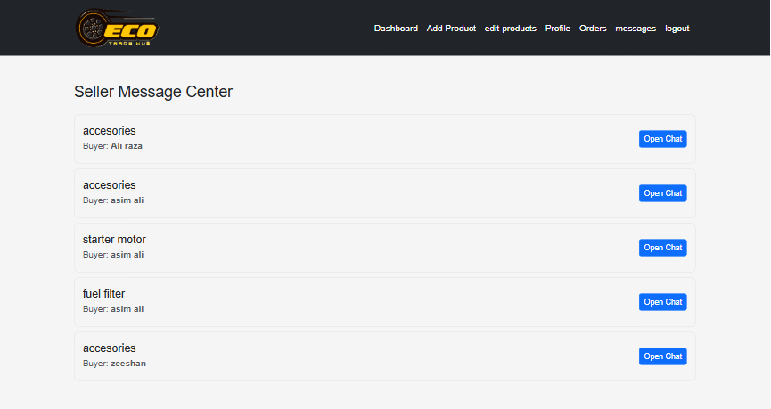
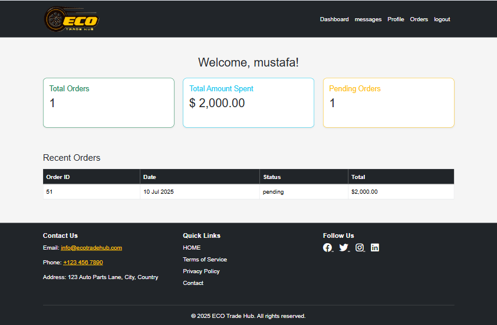
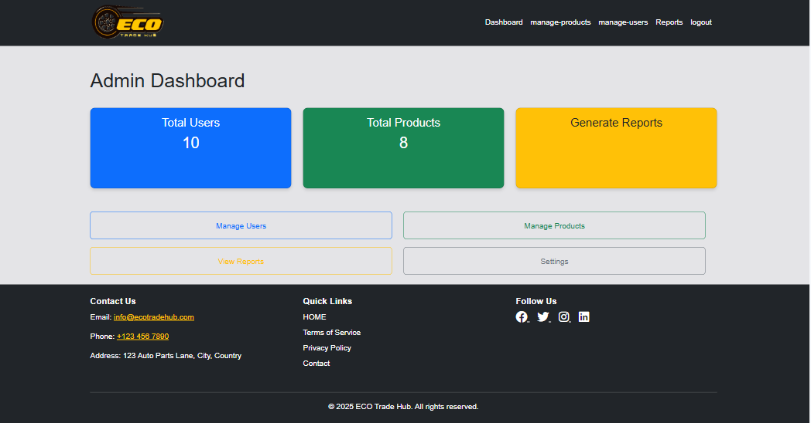
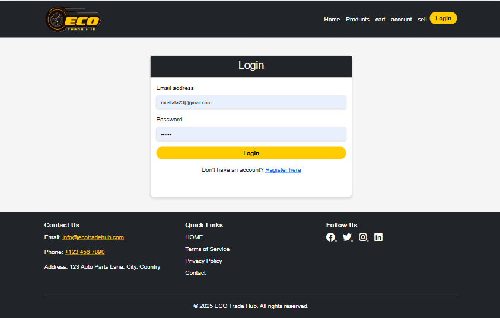
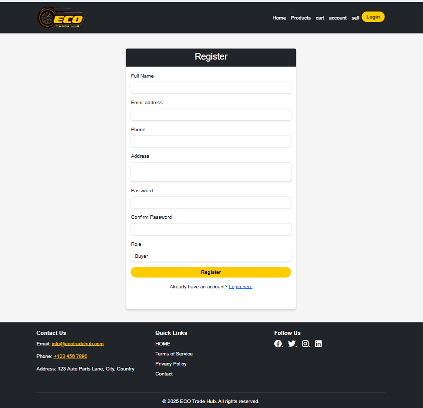
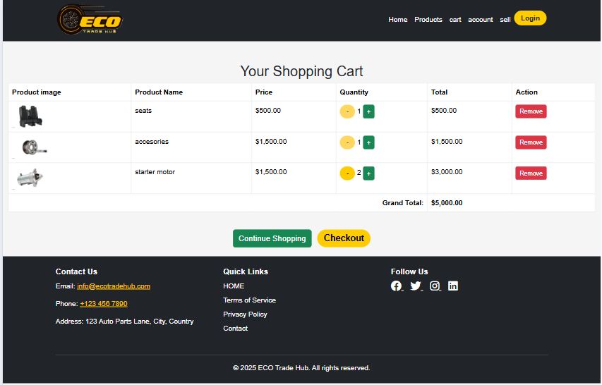
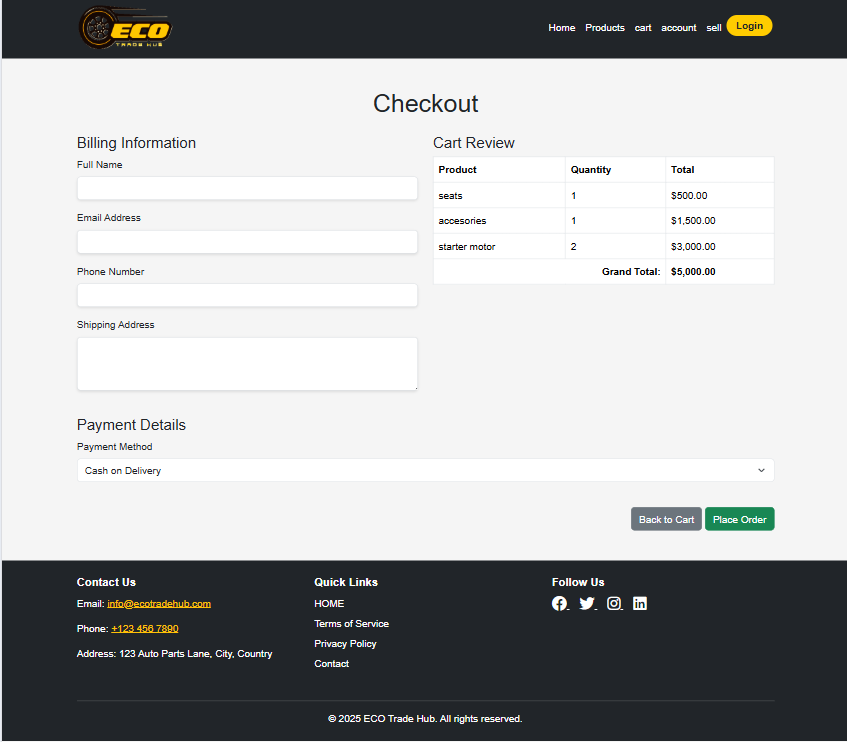

# ECO Trade Hub – Online Marketplace for Used Auto Parts 🔧🛒

A multi-vendor e-commerce platform built using PHP and MySQL that enables buyers and sellers to trade used auto parts. Promotes eco-friendly recycling in the automotive sector.

---
## 🎯 Project Overview

This project promotes eco-friendly practices by reusing auto parts instead of discarding them. It is a fully functional multi-vendor marketplace featuring:

- 🔐 Role-based login (Buyer, Seller, Admin)
- 📦 Product listing with filters and categories
- 💬 Chat system between buyers and sellers
- 🛒 Cart and checkout system
- 📊 Admin panel to manage users, products, and reports
- ⭐ Ratings and reviews

---
## 🚀 Features

| Module           | Description                                                                |
|------------------|----------------------------------------------------------------------------|
| 👤 Buyer         | Browse products, chat with sellers, add to cart, checkout, write reviews   |
| 🛍️ Seller        | Add/manage products, view orders, chat with buyers                         |
| 🧑‍💼 Admin         | Manage users, products, categories, generate reports                       |
| 📱 Responsive UI | Mobile-friendly design using Bootstrap 5                                   |
| 💬 Chat          | Real-time message system on product detail pages                           |

---

## 🛠️ Technologies Used

- **Frontend:** HTML, CSS, Bootstrap 5, JavaScript
- **Backend:** PHP
- **Database:** MySQL
- **Others:** XAMPP (Apache + MySQL server)

---

## 🚀 How to Run

1. Import `eco_trade_hub.sql` into phpMyAdmin
2. Copy folder into `htdocs/` (XAMPP)
3. Start Apache & MySQL
4. Visit: `http://localhost/ECO_Trade_Hub/pages/index.php`

---

## 📸 Screenshots

### 🏠 Homepage

### 📃 Product Listing with Filters

### 🛍️ Product Detail + Chat + Review

### 🧑‍💼 Dashboard

### 🔐 Login / Register

### 🛒 Cart & Checkout System

---
## 🔐 License

This project is for academic and educational use only.
No part of it may be reused commercially without permission.

---
## 🙋‍♀️ Author

**Sonia Nazeer**  
Final Year BCS Student  
[GitHub Profile](https://github.com/sonia-nazeer)  
[LinkedIn (optional)] (www.linkedin.com/in/sonia-nazeer-aba72b280)

---
